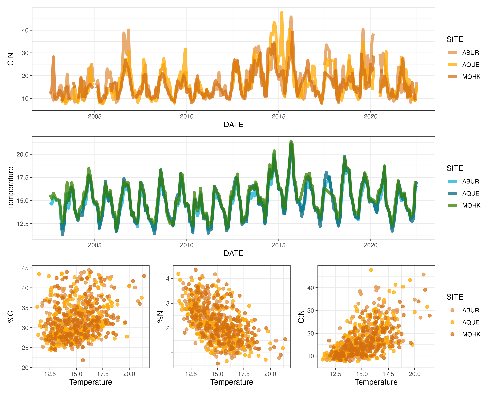

# eco_memory_kelp
Repository containing scripts and data exploring exogenous and endogenous memory in kelp tissue nutritional content.

All [nutritional data (carbon:nitrogen)](https://sbclter.msi.ucsb.edu/data/catalog/package/?package=knb-lter-sbc.24) and [reef bottom temperature data (degrees Celsius)](https://sbclter.msi.ucsb.edu/data/catalog/package/?package=knb-lter-sbc.13) is publicly available and can be downloaded from the [Santa Barbara Coastal Long Term Ecological Research Program's data portal](https://sbclter.msi.ucsb.edu/data/catalog/).

For additional context regarding the modeling methods employed in this project, please see [Ogle et al. 2015](https://doi.org/10.1111/ele.12399).

Contact code authors at heili.lowman *at* duke.edu or ana.miller-ter-kuile *at* nau.edu.

 
